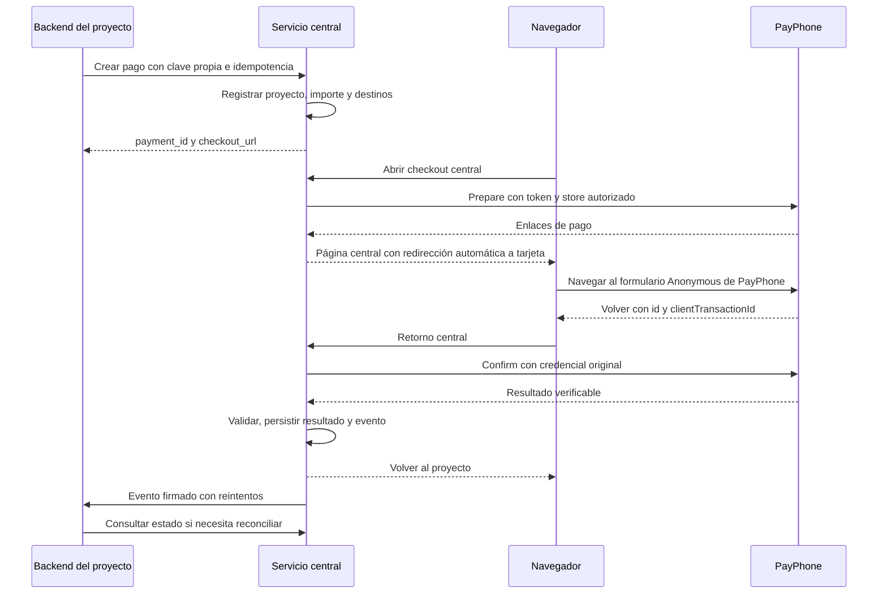

# Propuesta: servicio central de pagos PayPhone

Fecha de investigación: 2026-09-15. Estado: documento de diseño histórico.
El MVP descrito aquí ya cuenta con una implementación base; las capacidades
que aparecen como recomendadas o futuras no deben interpretarse como rutas
disponibles. Todos los dominios, identificadores y ejemplos de este documento
son genéricos o están anonimizados.

## Conclusión

La arquitectura propuesta es un servicio que registra y confirma pagos, mantiene su estado y entrega resultados a cada proyecto. La recomendación inicial es usar el botón por redirección desde un checkout central: una aplicación WEB en producción y otra WEB en pruebas. La viabilidad de reutilizar el token con todas las tiendas deseadas todavía necesita una prueba de integración; el parámetro `storeId` por sí solo no acredita ese permiso.

Confirmado por el usuario: todos los proyectos cobran para su misma cuenta/comercio PayPhone. Se mantiene su propuesta de una tienda por proyecto para clasificar ventas. Separar proyectos dentro del servicio no depende de que exista una tienda distinta para cada uno: la identidad del proyecto y sus permisos los controla este servicio.

La guía oficial distingue aplicaciones WEB de aplicaciones API. Por tanto, no está demostrado que las mismas dos aplicaciones puedan habilitar también API Links y API Sale. El ambiente se selecciona en Developer: no se propone una URL sandbox inventada ni cambiar de modo la aplicación que ya procesa producción. [Configuración oficial](https://docs.payphone.app/configuracion-de-ambiente-y-credenciales).

## Distribución propuesta

| Recurso | Producción | Desarrollo |
| --- | --- | --- |
| Aplicación PayPhone | WEB configurada en producción | WEB configurada en pruebas |
| Sitio central | `pagos.example.net` | `pagos-dev.example.net` |
| Token PayPhone | Secreto de producción | Secreto de pruebas |
| Claves de proyectos | Exclusivas de producción | Exclusivas de pruebas |
| Datos y trabajos | Base y colas de producción | Base y colas separadas |
| Tiendas | Lista autorizada por proyecto | Tiendas permitidas por el token de pruebas, a validar |

Los dominios son ejemplos. La tercera aplicación queda libre en esta propuesta; agregar una familia API queda sujeto a compatibilidad y disponibilidad. Una tercera aplicación API no resolvería por sí sola tener API separada en pruebas y producción.

## Flujo recomendado



El botón necesita confirmación en cinco minutos después del pago. El servicio central debe cumplir ese plazo aunque el proyecto receptor esté caído; entregar el evento al proyecto es una tarea posterior. La página del checkout debe residir en el dominio registrado y redirigir automáticamente al enlace Anonymous de tarjeta para conservar el origen del navegador. Los enlaces propios se pueden compartir, pero no equivalen al producto API Links. [Botón de pago](https://docs.payphone.app/boton-de-pago).

Crear la preparación al abrir el checkout es una opción de diseño para enlaces propios duraderos. Se debe comprobar la vigencia de cada preparación, evitar que abrir o recargar la página cree intentos simultáneos y mostrar una confirmación explícita antes de iniciar otro intento.

## Modelo mínimo

| Entidad | Responsabilidad |
| --- | --- |
| `provider_connections` | Aplicación, ambiente, tipo WEB/API, referencia al secreto, versión de credencial y capacidades verificadas |
| `projects` | Cliente interno, claves autenticadoras, destinos autorizados y secreto de webhook |
| `project_stores` | Asignaciones explícitas de conexiones y tiendas permitidas para un proyecto |
| `payments` | Orden del proyecto, importe en centavos, moneda, desglose, estado y destino de retorno guardado |
| `payment_attempts` | Un intento ante PayPhone, referencia única, conexión/tienda originales, IDs y respuesta depurada |
| `outbox_events` | Eventos persistidos junto al cambio de estado para entrega fiable |
| `webhook_deliveries` | Intentos de entrega, respuesta, siguiente reintento y resultado |

Una orden puede tener varios intentos, pero el servicio debe detectar si más de uno termina cobrado. Nunca se debe perder un cobro tardío por haber abierto un nuevo intento. Un estado local de cancelación tampoco demuestra que PayPhone haya cancelado o reversado dinero.

El identificador enviado como `clientTransactionId` se genera centralmente y se resuelve en la base. No es necesario codificar en él el dominio, el tenant ni datos personales. Usar un identificador opaco, con restricción única y longitud compatible con el adaptador; conservar aparte el identificador de orden del proyecto.

La rotación de claves internas no debe interrumpir pagos pendientes. Para credenciales PayPhone, guardar qué conexión originó cada intento y comprobar el comportamiento de la rotación antes de revocar la credencial anterior.

## API que consumirían los proyectos

Contrato propuesto, no endpoints existentes:

```http
POST /v1/payments
Authorization: Bearer <clave-del-proyecto>
Idempotency-Key: <clave-unica-de-la-operacion>
Content-Type: application/json

{
  "order_id": "pedido-123",
  "amount": 1150,
  "currency": "USD",
  "amount_without_tax": 0,
  "amount_with_tax": 1000,
  "tax": 150,
  "return_destination": "checkout_result"
}
```

La respuesta contendría `payment_id`, `status` y `checkout_url`. El ejemplo ilustra un desglose, no calcula la obligación tributaria del proyecto. La clave autenticadora determina proyecto y ambiente; la asignación administrativa determina conexión y tienda. Si un proyecto tiene varias tiendas, puede elegir un alias de su lista autorizada.

Otros endpoints mínimos:

- `GET /v1/payments/{id}`: consulta autenticada con autorización por proyecto.
- `GET /checkout/{public_token}`: página pública con información mínima y token impredecible.
- `GET /payphone/return`: recibe el retorno del navegador y dispara la confirmación.
- Endpoint receptor opcional de Notificación Externa, solo si está habilitado.

Los proyectos reciben eventos como `payment.succeeded` y `payment.reversed`, con `event_id`, `payment_id`, `order_id`, importe, moneda y ambiente. Firmar el cuerpo y la fecha con un secreto por proyecto. Los consumidores deduplican por `event_id`; la entrega es al menos una vez. El navegador muestra un resultado, pero no autoriza por sí solo a entregar el producto.

## Reglas de consistencia

Estas son decisiones recomendadas para nuestra implementación:

1. Persistir la intención antes de llamar al proveedor. Misma clave de idempotencia y mismos datos devuelve la operación original; datos diferentes producen conflicto. Un timeout al crear no permite asumir que PayPhone no recibió la solicitud.
2. Mantener un estado de resultado desconocido cuando falle la red. Antes de crear otro intento, reconciliar por los mecanismos realmente disponibles para ese token y producto.
3. Serializar confirmaciones concurrentes del retorno, worker y notificación. Mantener únicos los IDs del proveedor en el ámbito correcto, sin suponer que el proveedor garantiza unicidad entre ambientes.
4. Validar referencia, ID de transacción, estado, importe y moneda con la respuesta autenticada del proveedor. Si devuelve tienda, comprobarla; su ausencia no permite inventarla ni utilizar un nombre como identidad.
5. Usar enteros en centavos, con normalización explícita por endpoint. Evitar aceptar indistintamente dólares y centavos por heurística.
6. Separar `pending`, `confirmation_pending`, `paid`, `cancelled`, `failed`, `reversed` y `unknown`. Una observación pendiente no es un rechazo. El paso de `paid` a `reversed` requiere evidencia del proveedor.
7. Confirmar y guardar de forma prioritaria; ejecutar facturación, entrega del producto y avisos mediante eventos posteriores. Persistir el evento en la misma transacción local que el nuevo estado.
8. Guardar las URLs autorizadas en configuración, validar HTTPS y restringir destinos de webhooks para impedir llamadas a redes internas. No aceptar un `return_url` arbitrario en el retorno público.
9. Aplicar límites por proyecto y conexión. No repartir el token maestro a los proyectos ni incluirlo en el checkout por redirección.
10. Registrar métricas de confirmaciones pendientes, tiempo restante, fallos de conciliación y entregas atrasadas. Depurar secretos y datos de tarjeta de los registros.

## La ventana de cinco minutos y el cierre del navegador

El retorno del navegador puede no llegar. El diseño debe asumir ese caso, sin prometer recuperación que todavía no se haya probado.

La documentación de API Sale publica consulta por `transactionId` y por `clientTransactionId`; que esas consultas recuperen operaciones de botón con un token WEB necesita validación. Consultar estado tampoco debe confundirse con ejecutar Confirm. [API Sale](https://docs.payphone.app/api-sale).

Notificación Externa requiere aprobación previa y documenta pagos aprobados. No se debe suponer disponible, firmada criptográficamente o equivalente a Confirm. Si se habilita, usarla como disparador y verificar con PayPhone antes de cambiar el estado financiero. [Notificación Externa](https://docs.payphone.app/notificacion-externa).

La validación debe demostrar una vía independiente del navegador para obtener el ID y completar Confirm dentro del plazo. Si no existe con la configuración disponible, documentar que un pago cuyo retorno se pierde puede revertirse automáticamente: no marcarlo pagado, no cumplir la orden y reconciliar su estado. Un polling genérico no elimina esa limitación por sí solo.

## Qué aporta realmente una aplicación de referencia

Inspección de una aplicación de referencia, sin ejecutar esa aplicación ni sus
pruebas:

| Archivo | Evidencia |
| --- | --- |
| `app/Services/Payphone/PayphoneService.php` | Guarda una transacción central vinculada al tenant y llama a Prepare con retorno central |
| `app/Http/Controllers/Landlord/PayphoneWebhookController.php` | Recibe parámetros del navegador y deriva al flujo del tenant o del landlord |
| `app/Services/Payphone/TenantQuotationPaymentService.php` | Resuelve tenant desde la transacción, confirma, valida, deduplica y construye retorno |
| `routes/web.php` | Ofrece un enlace corto y una página central antes de navegar al proveedor |
| `resources/views/payphone/redirect.blade.php` | Utiliza una página HTML con política de referrer de origen |

El concepto se puede generalizar: sustituir tenant por proyecto y separar la confirmación del procesamiento de facturas. Sin embargo, el servicio de tenant carga token y tienda propios: este código no demuestra que un token compartido acepte cualquier store.

Puntos que requieren adaptación, identificados en la lectura:

- `amountMatches` acepta el importe tanto como dólares como centavos. En el nuevo servicio conviene un contrato preciso por endpoint.
- Hay caminos que convierten error de Confirm en fallo y agrupan estados 1/2 como cancelados. El nuevo modelo debe distinguir incertidumbre, espera y cancelación según el contrato verificado.
- `refreshPendingTransaction` en el servicio necesita un ID numérico previo; el adaptador de integraciones devuelve `null` en su método de refresco. No constituye una solución probada al retorno perdido.
- La prueba local del proxy comprueba el HTML y la URL permitida, no el comportamiento real de PayPhone en navegadores.
- La plantilla central sirve de antecedente, pero hay que verificar el flujo desde mensajería, móviles y navegadores con restricciones de referrer.

Son observaciones para diseñar este proyecto, no una auditoría completa ni
cambios realizados en la aplicación de referencia.

## Si aparecen comercios de terceros

El modelo puede admitir múltiples conexiones desde el principio. Si los fondos deben acreditarse a comercios distintos, no debe asumirse que basta con cambiar un store bajo el token propio. PayPhone documenta tokens delegados por comercio aliado, asociados a su RUC y wallet, sujetos a habilitación previa. También puede evaluarse que cada comercio aporte sus credenciales. [Token de terceros](https://docs.payphone.app/token-de-terceros).

## Validación antes de implementar el servicio completo

### Primera prueba realizada (2026-09-15)

Con el token local de pruebas, `POST /api/button/Prepare` respondió HTTP 200 para dos `storeId` distintos y devolvió enlaces de tarjeta y PayPhone en ambos casos. Por tanto, el token probado sí puede preparar pagos para las dos tiendas. La consulta preliminar `GET /api/Sale/client/{clientTransactionId}` respondió 404/código 20 para ambos; esto no demuestra recuperación de Button y queda pendiente probar después de completar un pago. El detalle y los identificadores efímeros están en [el informe de prueba](test-run-2026-09-15.md).

El rechazo observado al abrir los enlaces desde el chat también quedó aislado: sin `Referer` PayPhone devuelve “No autorizado”; con el `Referer` del dominio WEB registrado devuelve el formulario. `Origin` por sí solo no cambia el resultado. El checkout del proxy, por tanto, debe ser una página navegable en el dominio WEB registrado que navegue automáticamente al enlace de tarjeta; entregar el enlace de PayPhone directamente desde mensajería no es suficiente.

1. **Tiendas:** con una aplicación en pruebas, preparar y confirmar para dos stores autorizados; comprobar asociación y atribución. Registrar límite real conocido de tiendas, sin asumir que sea ilimitado.
2. **Origen:** desde dos sitios de proyecto y un enlace compartido, abrir la página central registrada y completar el pago. Probar escritorio, móvil y navegador integrado.
3. **Ambiente:** comprobar que el token de pruebas permanece en pruebas y que ningún proyecto de desarrollo puede seleccionar la conexión de producción.
4. **Confirmación:** verificar formatos exactos, importes, IDs, estados y comportamiento ante Confirm repetido o respuesta perdida.
5. **Retorno ausente:** cerrar la pestaña después de pagar, evaluar consulta por referencia con token WEB y, si está disponible, Notificación Externa. Observar también el reverso después del plazo.
6. **Aislamiento:** dos proyectos con el mismo `order_id`, callbacks manipulados, acceso cruzado y store no autorizado deben quedar correctamente separados.
7. **Recuperación:** simular timeout en Prepare/Confirm, worker reiniciado y proyecto receptor caído; comprobar que no se duplica el cobro ni se pierde el evento.
8. **Resultado incierto:** comprobar que nunca se entrega producto por query string, respuesta no autenticada o timeout tratado como éxito.

El plan de integración sigue pendiente: durante la investigación no se completó ningún cobro ni se modificaron aplicaciones; sí se hicieron solicitudes controladas de `Prepare` y consultas preliminares para validar el diagnóstico.

## Alcance inicial recomendado

Checkout central con botón por redirección, proyectos y tiendas autorizadas, claves propias, creación idempotente, confirmación, consulta de estado, entrega de eventos y trazabilidad. Mantener conexión y adaptador separados permite añadir otros productos sin exigirlos para el primer despliegue.

La primera prueba debe resolver las dos incertidumbres que cambian la decisión: token compartido entre stores y recuperación cuando no llega el navegador. Con esas evidencias se puede cerrar el alcance del MVP y su nivel de disponibilidad.
